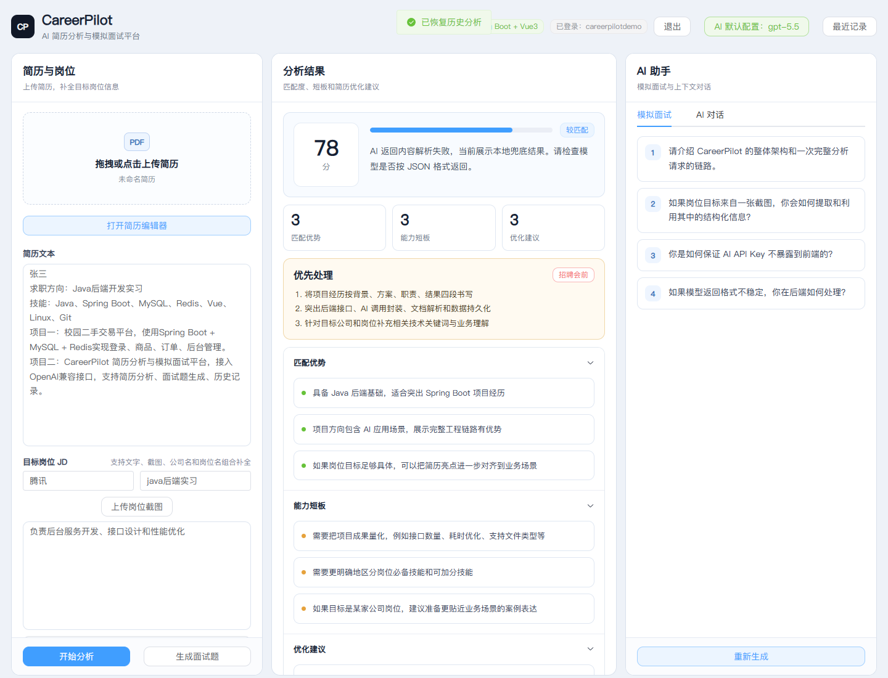
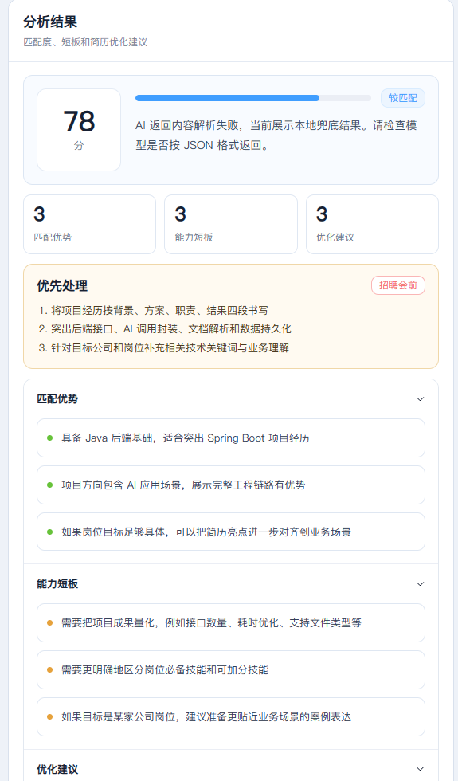
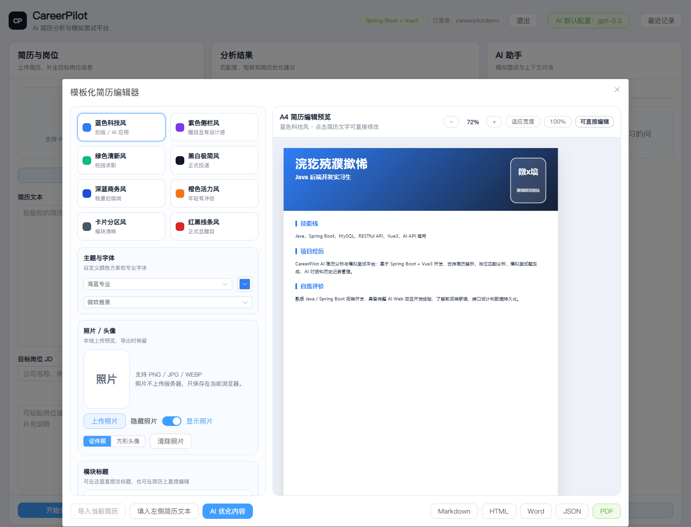
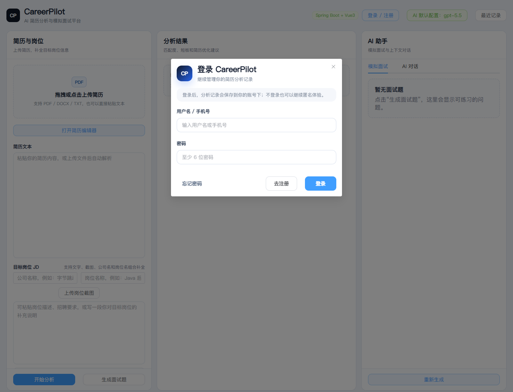
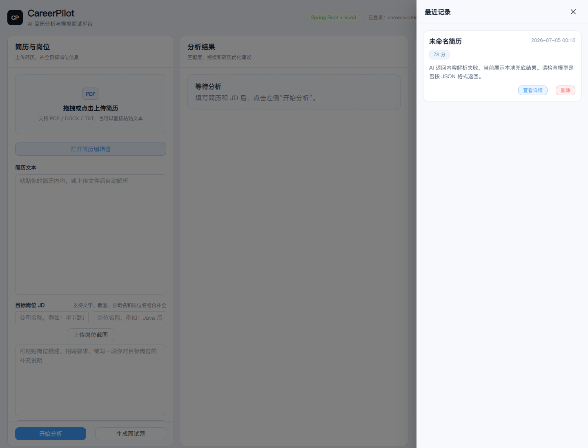

# CareerPilot

CareerPilot 是一个面向大学生求职场景的 AI 简历分析与模拟面试平台。项目围绕“简历上传/编辑 → 岗位 JD 输入 → AI 匹配分析 → 模拟面试 → 历史记录 → 简历导出”形成完整闭环，适合作为 Java 后端开发 / AI 应用后端开发方向的实习项目。

## 项目亮点

- **AI 简历分析**：支持上传 PDF、DOCX、TXT 简历，结合目标岗位 JD 输出匹配分数、优势、短板、优化建议和项目改写建议。
- **目标岗位智能补全**：支持输入公司名、岗位名、岗位描述，或直接上传岗位截图，自动识别关键信息并联网补全更贴近真实招聘要求的岗位上下文。
- **模拟面试助手**：根据当前简历和岗位要求生成面试题，帮助用户围绕 Java、Spring Boot、MySQL、Redis、AI 项目经验做准备。
- **NotebookLM 风格工作台**：页面采用三栏布局，左侧简历与岗位，中间分析结果，右侧 AI 助手，整体页面固定高度，各区域独立滚动。
- **模板化简历编辑器**：支持 A4 简历直接编辑、照片上传、主题色、字体、缩放、多套模板和 PDF/HTML/Word/JSON/Markdown 导出。
- **用户体系**：实现手机号验证码注册、登录、忘记密码、JWT 鉴权，验证码优先使用 Redis 缓存。
- **历史记录管理**：分析结果和 AI 对话自动保存，支持查看详情、恢复现场、删除记录，并按登录用户隔离数据。
- **AI 配置灵活**：支持后端默认 AI 配置，也支持用户在前端填写自己的 OpenAI 兼容中转站配置。
- **Docker 一键部署**：提供 Docker Compose 编排，一键启动 MySQL、Redis、Spring Boot 后端和 Nginx 前端。
- **工程规范**：采用 Controller / Service / Repository 分层，统一返回结构、全局异常处理、参数校验、日志记录和 AI 异常兜底。

## 项目截图

### 三栏主工作台



### AI 分析结果



### 模板化简历编辑器



### 登录注册



### 最近记录



## 技术栈

| 方向 | 技术 |
| --- | --- |
| 后端 | Java 17、Spring Boot 3、Spring Web、Spring Data JPA、Spring Validation |
| 数据 | H2 / MySQL、Redis、JPA 自动建表 |
| 文件解析 | Apache Tika |
| AI 调用 | OpenAI 兼容 Chat Completions 接口、WebClient |
| 前端 | Vue 3、Vite、Element Plus、Axios |
| 鉴权 | 轻量 JWT Token、密码加盐哈希 |

## 功能模块

### 1. 简历上传与解析

- 支持 PDF、DOCX、TXT 文件上传。
- 使用 Apache Tika 提取文件文本。
- 支持不上传文件，直接粘贴简历文本。
- 后端限制上传文件大小和文件类型，避免异常文件影响服务稳定性。

### 2. AI 岗位匹配分析

- 输入目标岗位 JD 后，系统结合简历内容调用大模型。
- 支持通过公司名、岗位名、岗位截图和岗位描述触发目标岗位识别与联网补全。
- 支持优先抽取公司岗位要求、职责描述和招聘平台落地页正文，减少只拿到公司介绍的情况。
- 输出匹配分数、分析摘要、匹配优势、能力短板、优化建议、项目经历改写建议。
- AI 调用异常时返回本地兜底结果，保证演示时页面可用。

### 3. AI 模拟面试

- 根据简历和岗位 JD 生成模拟面试题。
- 题目覆盖 Java 基础、Spring Boot、数据库、项目设计、AI API 调用等方向。
- 适合招聘会前快速准备项目讲解和技术追问。

### 4. AI 对话助手

- 用户可在右上角填写自己的 `AI_API_KEY`、`AI_BASE_URL`、`AI_MODEL`。
- 已配置前端 AI 后，可在右侧 AI 对话区继续追问简历优化、项目描述、面试回答。
- 未配置用户 AI 时，AI 对话不可用，避免消耗项目默认 Key。
- 登录后 AI 对话会自动保存为历史会话，支持恢复上下文和删除会话。

### 5. 简历编辑器

- 支持 8 套模板，覆盖科技风、商务风、极简风、校招风等场景。
- 支持直接在 A4 简历预览上编辑文字。
- 支持上传本地照片，切换证件照/方形头像。
- 支持主题色、字体、自定义主色。
- 支持预览缩放、适应宽度、100% 查看。
- 支持导出：
  - PDF：浏览器打印另存为 PDF。
  - Word：导出 WPS/Word 可编辑 `.doc` 文件。
  - HTML：导出完整静态页面。
  - JSON：导出模板、字段和内容数据。
  - Markdown：导出文本版简历。

### 6. 登录注册与历史记录

- 支持手机号验证码注册。
- 支持用户名/手机号登录。
- 支持忘记密码，通过手机号验证码重置。
- 验证码优先写入 Redis，Redis 不可用时自动使用本地缓存兜底。
- 登录后分析记录绑定用户 ID，历史记录按用户隔离。

## 系统流程

```text
注册/登录
  ↓
上传或编辑简历
  ↓
输入目标岗位 JD
  ↓
AI 简历分析
  ↓
生成优化建议和模拟面试题
  ↓
保存历史记录
  ↓
查看/恢复历史记录
  ↓
继续 AI 对话或导出简历
```

## 快速启动

### 环境要求

- JDK 17+
- Maven 3.8+
- Node.js 18+
- Redis 可选；未启动 Redis 时验证码会使用本地缓存兜底

### 1. 启动后端

```powershell
cd C:\Users\Administrator\CareerPilot\backend
copy .env.example .env
mvn spring-boot:run
```

后端默认地址：

```text
http://localhost:8080
```

`.env` 示例：

```env
AI_API_KEY=你的完整Key
AI_BASE_URL=https://api.okinto.com/v1
AI_MODEL=gpt-5.2
JWT_SECRET=careerpilot-change-me
REDIS_HOST=localhost
REDIS_PORT=6379
```

默认使用 H2 文件数据库。如果要切换 MySQL，在 `.env` 中继续加入：

```env
SPRING_PROFILES_ACTIVE=mysql
MYSQL_URL=jdbc:mysql://localhost:3306/careerpilot?useUnicode=true&characterEncoding=utf8&serverTimezone=Asia/Shanghai&useSSL=false&allowPublicKeyRetrieval=true
MYSQL_USERNAME=root
MYSQL_PASSWORD=123456
JPA_DDL_AUTO=update
```

### 2. 启动前端

```powershell
cd C:\Users\Administrator\CareerPilot\frontend
npm install
npm run dev
```

前端默认地址：

```text
http://localhost:5173
```

## Docker 部署

项目已支持 Docker Compose 一键部署 MySQL、Redis、后端和前端：

```powershell
cd C:\Users\Administrator\CareerPilot
docker compose up -d --build
```

启动后访问：

- 前端页面：`http://localhost:3000`
- 后端健康检查：`http://localhost:8081/api/health`
- Docker MySQL：`localhost:3307`
- Docker Redis：`localhost:6380`

详细说明见：`docs/docker-deploy.md`

## 主要接口

完整接口文档见：`docs/api.md`

| 方法 | 地址 | 说明 |
| --- | --- | --- |
| GET | `/api/health` | 健康检查 |
| POST | `/api/auth/send-code` | 发送验证码 |
| POST | `/api/auth/register` | 注册 |
| POST | `/api/auth/login` | 登录 |
| POST | `/api/auth/reset-password` | 重置密码 |
| GET | `/api/ai/status` | 查询后端默认 AI 配置 |
| POST | `/api/resumes/parse` | 上传并解析简历 |
| POST | `/api/resumes/build` | 生成/优化 Markdown 简历 |
| POST | `/api/analysis` | AI 简历岗位匹配分析 |
| GET | `/api/analysis/records` | 查询历史记录 |
| GET | `/api/analysis/records/{id}` | 查询历史详情 |
| DELETE | `/api/analysis/records/{id}` | 删除历史记录 |
| POST | `/api/interview/questions` | 生成模拟面试题 |
| POST | `/api/chat` | AI 对话 |
| GET | `/api/chat/sessions` | 查询 AI 对话历史 |
| GET | `/api/chat/sessions/{id}` | 恢复 AI 对话详情 |
| DELETE | `/api/chat/sessions/{id}` | 删除 AI 对话历史 |

## 数据库说明

当前默认使用 H2 文件数据库，便于本地演示：

```text
backend/data/careerpilot.mv.db
```

核心表包括：

- `app_user`：用户信息。
- `analysis_record`：简历分析历史记录。
- `chat_session`：AI 对话会话记录。
- `chat_message_record`：AI 对话消息记录。

项目已支持 MySQL profile，设置 `SPRING_PROFILES_ACTIVE=mysql` 后即可切换到 MySQL。数据库字段、索引和建表脚本见：`docs/database.md`、`docs/schema-mysql.sql`

## 演示流程

招聘会现场建议按以下顺序演示：

1. 打开首页，介绍 CareerPilot 解决“大学生不知道怎么改简历、怎么准备面试”的问题。
2. 注册/登录，展示手机号验证码和用户隔离。
3. 上传一份 PDF/DOCX/TXT 简历，或粘贴示例简历。
4. 输入 Java 后端实习 JD，点击开始分析。
5. 展示匹配分数、短板、优化建议和项目改写。
6. 点击生成模拟面试题。
7. 打开历史记录，展示详情恢复和删除。
8. 打开简历编辑器，切换模板、修改文字、上传照片并导出 WPS 可编辑 Word。
9. 打开 AI 设置，说明支持用户自带中转站配置。

更详细演示话术见：`docs/demo-script.md`

## 简历项目写法

**CareerPilot AI 简历分析与模拟面试平台｜Java 后端开发｜Spring Boot、JPA、H2/MySQL、Redis、Apache Tika、Vue3、OpenAI 兼容接口**

- 面向大学生求职场景，开发 AI 简历分析与模拟面试平台，支持上传 PDF/DOCX/TXT 简历并输入目标岗位 JD，自动生成岗位匹配度、技能短板、简历优化建议和模拟面试题。
- 负责后端核心模块开发，基于 Spring Boot 设计 RESTful API，包括简历解析、岗位匹配分析、模拟面试题生成、AI 配置状态检测、历史记录查询和 AI 对话接口。
- 使用 Apache Tika 实现多格式简历文本提取，并对解析结果进行清洗、长度控制和结构化封装，提升 AI 分析输入质量。
- 封装 OpenAI 兼容大模型调用服务，支持后端默认配置和用户前端自定义中转站配置，避免 API Key 写死在代码中。
- 使用 JPA 持久化分析记录和 AI 对话记录，保存简历名称、岗位 JD、匹配分数、完整 JSON 结果、会话标题和消息内容，支持历史列表、详情恢复和删除。
- 实现手机号验证码注册登录、忘记密码、Redis 验证码缓存和轻量 JWT 鉴权，登录后分析记录按用户隔离。
- 增加统一返回结构、全局异常处理、文件校验、AI 调用超时控制和本地兜底结果，提高系统稳定性和演示可靠性。
- 使用 Vue3 + Element Plus 完成三栏式前端界面，实现简历上传、JD 输入、分析展示、模拟面试、AI 对话、模板化简历编辑、多格式导出和历史记录管理。

## 后续优化

- 增加用户每日 AI 调用额度和默认 Key 保护策略。
- 增加 AI 对话历史搜索、导出和会话重命名。
- 优化 Docker 镜像体积和生产环境配置。
- 接入真实短信服务，替换本地显示验证码的演示方案。
- 部署到云服务器并配置域名、HTTPS 和 Nginx 反向代理。
